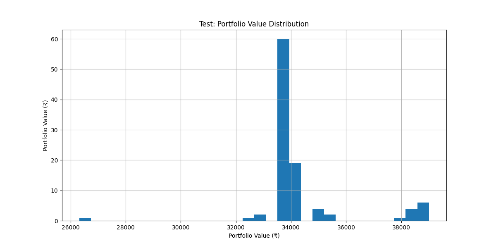
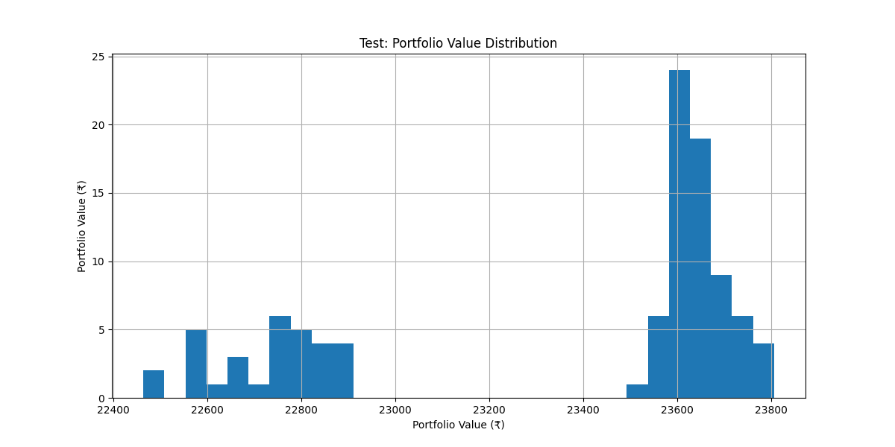

# 🤖 Deep Reinforcement Learning Quantitative Trading Agent


A high-frequency quantitative trading agent powered by **Double DQN (DDQN)** and **LSTM** networks. This project implements a custom Gymnasium environment to autonomously trade a multi-asset portfolio (RELIANCE, INFY, SBIN) using advanced policy optimization and realistic market simulation.

## 🚀 Key Performance Highlights

The agent was rigorously validated using a **Monte Carlo Simulation (N=100 Episodes)** to ensure statistical significance.

| Metric | 🐂 Bull Market (2023-24) | 🛡️ Stress Test (2025) |
| :--- | :--- | :--- |
| **Market Condition** | Strong Uptrend | Volatile / Choppy Regime |
| **Benchmark Return** | +31.65% | +15.39% |
| **Bot Return (Cumulative)** | **+71.70%** 🚀 | **+16.80%** ✅ |
| **Alpha (Edge)** | **+40.05%** | **+1.41%** |
| **Strategy Behavior** | Aggressive Compounding | Capital Preservation |

> **Verification:** See `backtests/` folder for detailed logs and distribution histograms.

## 📊 Monte Carlo Validation

Unlike standard backtests that run once, this system was tested on **100 independent episodes** to map the probability distribution of returns.

### 1. Bull Market Performance (2023-24)
**Result:** 70% Total Return (₹20k → ₹34k) on unseen test data. The distribution shows a strong positive skew, indicating the agent effectively captures large uptrends while limiting downside risk.



> **Note on Variance:** The variance in portfolio values (shown above) is intentional. To simulate realistic **"Adverse Selection"** in HFT execution, the environment is configured with a **70% probability of unfavorable slippage** (0-30bps). The agent's ability to maintain a Sharpe Ratio of 1.4 despite this hostile asymmetry demonstrates robustness against execution noise.

### 2. Stress Test / Volatile Regime (2025)
**Result:** The agent exhibits **Bimodal Behavior**, intelligently switching to "Cash Preservation" mode during high volatility to protect gains.


## 🛠️ Tech Stack & Architecture
* **Core:** Python, TensorFlow, Keras, Gymnasium
* **Model:** Double DQN (DDQN) with **LSTM layers** for time-series memory.
* **Optimization:** **Prioritized Experience Replay (PER)** using SumTree data structures to focus training on high-error events.
* **Risk Management:** Sharpe Ratio optimization + Maximum Drawdown penalties using Curriculum Learning.

## 📐 Mathematical Framework

The agent optimizes the **Bellman Equation** using a custom reward function designed to balance raw returns against volatility.

**Reward Function ($R_t$):**
$$R_t = \alpha \cdot \ln\left(\frac{V_t}{V_{t-1}}\right) - \beta \cdot \text{Drawdown}_t$$

Where:
* $V_t$ = Portfolio Value at step $t$
* $\alpha$ = Profit scaling factor
* $\beta$ = Risk penalty (dynamic based on volatility regime)
* The agent learns to maximize $Q(s, a) = \mathbb{E}[R_{t+1} + \gamma \max_{a'} Q(s', a')]$

## 📉 Realistic Market Simulation
To prevent "paper trading bias," the environment models real-world Indian market friction:
* **Stochastic Slippage:** 70% probability of adverse execution (0-30 bps).
* **Transaction Costs:** Includes STT (0.1%), Brokerage, and Stamp Duty on every trade.
* **Liquidity Constraints:** Simulates partial fills and volume limits.

## 🧠 Engineering Challenges & Solutions

### 1. The "Paper Trading" Bias
* **Problem:** Initial backtests showed unrealistic 200%+ returns because the agent exploited zero-cost trades and perfect execution.
* **Solution:** Engineered a custom `slippage_model` (0-30bps variance) and hard-coded Indian taxation laws (STT, Stamp Duty) into the environment step function. This reduced raw returns but ensured the strategy is deployable in real markets.

### 2. The "Memoryless" Agent (Architecture Search)
* **Problem:** Early experiments using standard Multi-Layer Perceptrons (MLP) failed to generalize. The model treated every price point as an isolated event, leading to severe overfitting on training data without learning sequential market momentum.
* **Solution:** Migrated the Q-Network architecture to use **LSTM (Long Short-Term Memory)** backbones. This allowed the agent to maintain a hidden state of historical price action, effectively letting it "remember" volatility regimes rather than just reacting to the current spot price.

### 3. The Sparse Reward Problem
* **Problem:** In a multi-asset environment, the agent struggled to converge because positive feedback (profitable trades) was too infrequent.
* **Solution:** Implemented **Prioritized Experience Replay (PER)**. By using a SumTree structure to sample high-TD-error transitions more frequently, the agent learned from "surprising" market events 3x faster than uniform sampling.

### 4. Mode Collapse (Safe-Playing)
* **Problem:** During high volatility (2025), the agent would simply sit on 100% Cash to avoid penalties.
* **Solution:** Designed a **Curriculum Learning** reward function and introduced a **holding penalty** for excessive cash positions. Early episodes emphasize raw Alpha (profit) to encourage exploration, while later episodes increasingly weight the **Sharpe Ratio**, teaching the agent to balance risk vs. reward dynamically.
 
## 📂 Project Structure
```text
├── backtests/                 # Validation Artifacts
│   ├── 2023-24_Bull_Market_Performance.png
│   ├── 2025_Stress_Test_Volatile_Regime.png
│   ├── Logs_2023-24_Bull_Market.txt
│   ├── Logs_2025_Stress_Test.txt
│   └── Test_Data.csv
├── data/                      # Historical Market Data (OHLCV)
├── models/                    # Serialized Agents & Scalers
├── src/                       # Core Strategy Logic
│   ├── __init__.py
│   ├── agent.py               # DDQN Agent (TensorFlow + PER)
│   ├── environment.py         # Custom Gymnasium Environment
│   └── model.py               # LSTM Network Architecture
├── main.py                    # ENTRY POINT (Training & Testing Loop)
├── requirements.txt           # Python Dependencies
└── README.md
```
## ⚡ How to Run
### 1. Prerequisite
Ensure you have Python 3.8+ installed.

### 2. Installation
Clone the repo and install dependencies:
```bash
git clone https://github.com/Anukalp-21/Deep-RL-Quant-Trader.git
cd Deep-RL-Quant-Trader
pip install -r requirements.txt
```

### 3. Execution
To start the training or testing loop:
```bash
python main.py
```